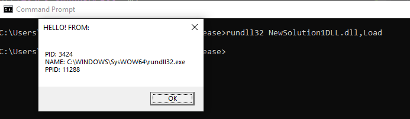

# useful_shellcode
 Collection of useful shellcode for my personal reference. 
 All shellcode below was generated by writing a DLL and converting to PIC shellcode using ConvertTo-Shellcode.ps1 from Nick Landers avaialble here: https://github.com/monoxgas/sRDI/tree/master/PowerShell 

## Process Information
 This shellcode displays a Windows messagebox window containing the following detals: PID, Image Name, PPID
 Example:
 

### Source Code
 This shellcode was generated from the following source code:
````
#include <iostream>
#include <string>
#include <sstream>
#include <Windows.h>
#include <TlHelp32.h>
using namespace std;

int runme()
{
	LPWSTR procName = new WCHAR[MAX_PATH];
	// Get PID
	DWORD procID = GetCurrentProcessId();
	// Get file name
	GetModuleFileNameW(NULL, procName, MAX_PATH);
	// Get PPID
	DWORD ppid = -1;
	HANDLE procHndls = CreateToolhelp32Snapshot(TH32CS_SNAPPROCESS, 0);
	PROCESSENTRY32W procEntry = { 0 };
	procEntry.dwSize = sizeof(PROCESSENTRY32W);
	if (Process32FirstW(procHndls, &procEntry))
	{
		do
		{
			if (procEntry.th32ProcessID == procID)
			{
				ppid = procEntry.th32ParentProcessID;
			}
		} while (Process32NextW(procHndls, &procEntry));
	}
	CloseHandle(procHndls);
	std::wstringstream oss;
	oss << "PID: " << procID << endl << "NAME: " << procName << endl << "PPID: " << ppid;
	std::wstring printable = oss.str();
	MessageBoxW(0, printable.c_str(), L"HELLO! FROM:", MB_OK);

	return 0;
}
````