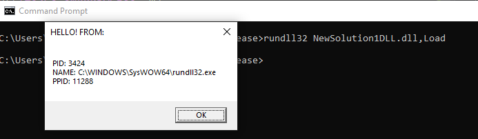

# useful_shellcode
 Collection of useful shellcode for my personal reference. 
 All shellcode was generated by writing a DLL and converting to PIC shellcode using ConvertTo-Shellcode.ps1 from Nick Landers avaialble here: https://github.com/monoxgas/sRDI/tree/master/PowerShell 

## Process Information
 This shellcode displays a Windows messagebox window containing the following detals: PID, Image Name, PPID. Handy for troublehsooting custom payload injection code.
 Example:
 
